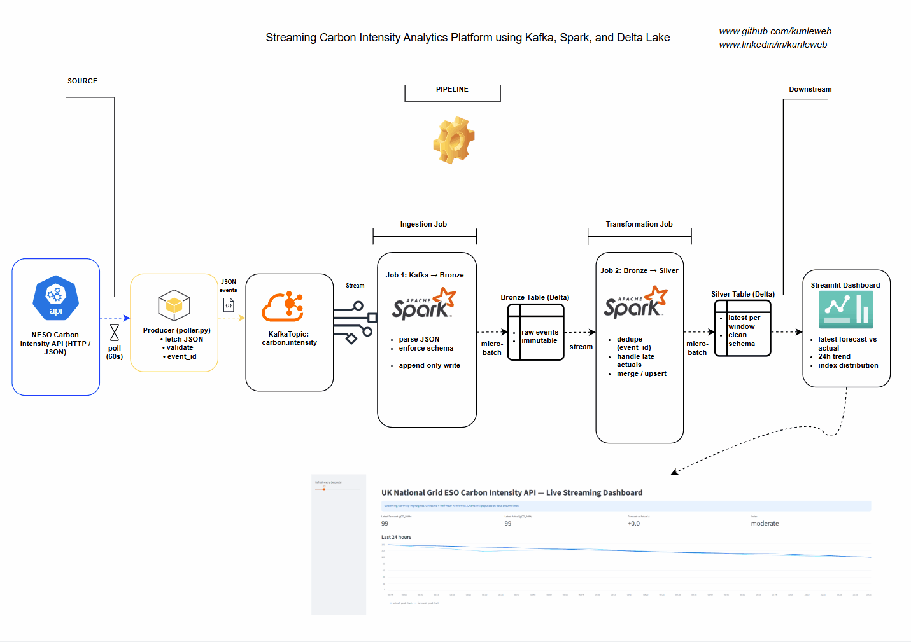
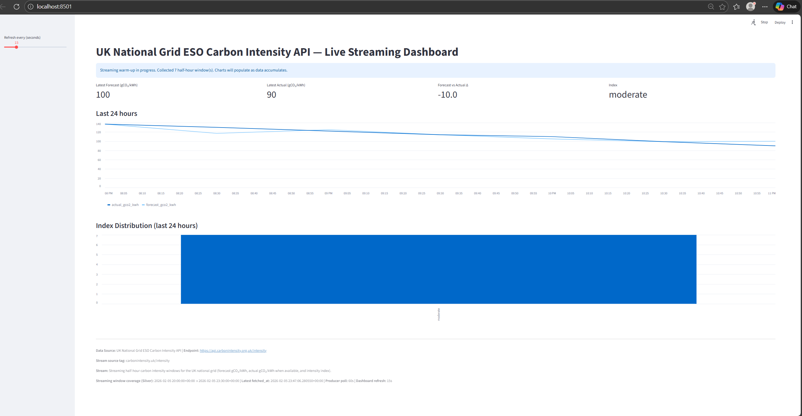

# Streaming Lakehouse for NESO UK Carbon Intensity Analytics



## Overview

Welcome to the **NESO UK Carbon Intensity Streaming Lakehouse**. This project allows you to build a real-time data pipeline that ingests, processes, and visualizes carbon intensity data from the UK National Grid ESO API.

It demonstrates a full "Medallion Architecture" (Bronze -> Silver -> Gold) using **Apache Spark Structured Streaming**, **Delta Lake**, and **Kafka**, all culminating in a live **Streamlit** dashboard.

## System Architecture

The pipeline follows a strictly linear flow designed for robustness and data quality:

1.  **Producer Service**: A Python poller fetches live JSON data from the Carbon Intensity API every 60 seconds and pushes it to Kafka.
2.  **Ingestion Layer (Bronze)**: A Spark Streaming job reads from Kafka and appends raw JSON events to a **Bronze Delta Table**. This layer preserves history and allows for replayability.
3.  **Transformation Layer (Silver)**: A second Spark Streaming job reads from Bronze, performs deduplication (handling 30-minute rolling windows), enforces schema, and upserts clean data into a **Silver Delta Table**.
4.  **Serving Layer (Dashboard)**: A Streamlit app polls the Silver table to provide a live, auto-refreshing interface for monitoring grid carbon intensity.

## Prerequisites

Before running the project, ensure you have the following installed:

*   **Python 3.10+**
*   **Java 17 (OpenJDK)**: Required for Spark.
*   **Apache Kafka**: You can run this locally or use a cloud provider.
*   **Hadoop Binaries (Windows only)**: If on Windows, ensure your `winutils.exe` and `hadoop.dll` are set up.

## Installation

1.  **Clone the Repository**
    ```bash
    git clone https://github.com/YourUsername/Streaming-Lakehouse-for-NESO-UK-Carbon-Intensity-Analytics.git
    cd Streaming-Lakehouse-for-NESO-UK-Carbon-Intensity-Analytics
    ```

2.  **Set Up Virtual Environment**
    ```bash
    python -m venv .venv
    source .venv/bin/activate  # On Windows: .venv\Scripts\activate
    ```

3.  **Install Dependencies**
    ```bash
    pip install -r spark/requirements.txt
    ```

## How to Run the Pipeline

Run each component in a separate terminal window to observe the full real-time flow.

### 1. Start the Data Producer
This script polls the API and sends data to your Kafka topic `carbon.intensity.uk`.
```bash
python producer/poller.py
```

### 2. Start the Bronze Ingestion Job (Spark)
This Spark job consumes the Kafka stream and writes raw data to the Delta Lake Bronze table.
```bash
python spark/01_kafka_to_bronze.py
```
*Wait for the "Batch processed" logs to appear.*

### 3. Start the Silver Transformation Job (Spark)
This job processes the Bronze data, handling deduplication and merging updates into the Silver table.
```bash
python spark/02_bronze_to_silver.py
```

### 4. Launch the Dashboard
Finally, spin up the Streamlit interface to visualize the data live.
```bash
streamlit run dashboard/app.py
```

## Live Dashboard

Once running, you can monitor the UK's carbon intensity in real-time, including forecast vs. actual deltas and streaming metrics.



## Directory Structure

*   `producer/`: Contains the `poller.py` service.
*   `spark/`: Contains the PySpark streaming jobs (`01_kafka_to_bronze.py`, `02_bronze_to_silver.py`).
*   `dashboard/`: Contains the Streamlit `app.py`.
*   `data/`: Local storage for Delta Tables and checkpoints (automatically generated).

## License

This project is open-source and available under the MIT License.